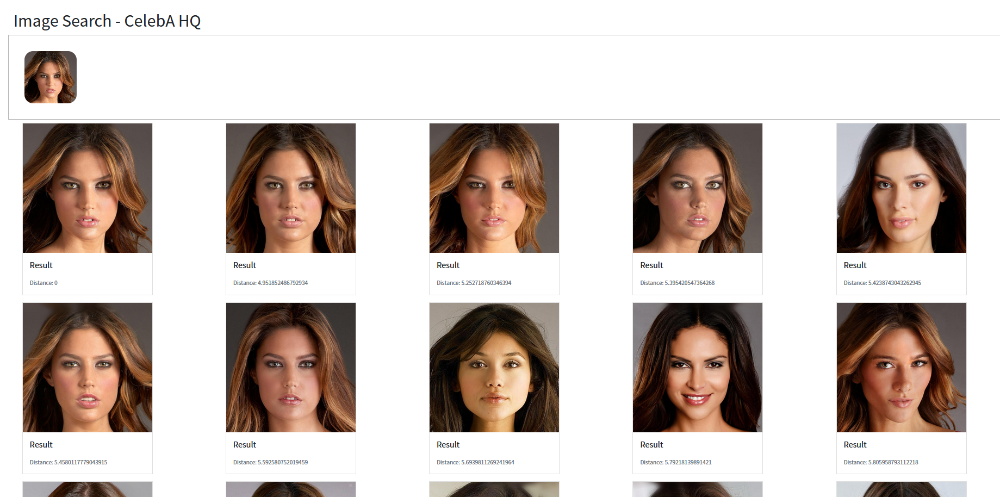

## Image Search

This is a proof-of-concept image search application that uses `Python`, `PyTorch` and `scikit-learn` to extract features from `CelebA-HQ` dataset.

### Getting the Dataset

I downloaded the dataset from `https://github.com/switchablenorms/CelebAMask-HQ`. After that you only need the image files under the directory `CelebA-HQ-img`.

### General Info

- Feel free to use anything for your projects.
- Tested with `Windows` and `Python 3.8.6` only but it should also work for others
- Everything is set in the `config.json`
- Run `python extractor.py` first and when extraction is complete, run `python webapp.py`
